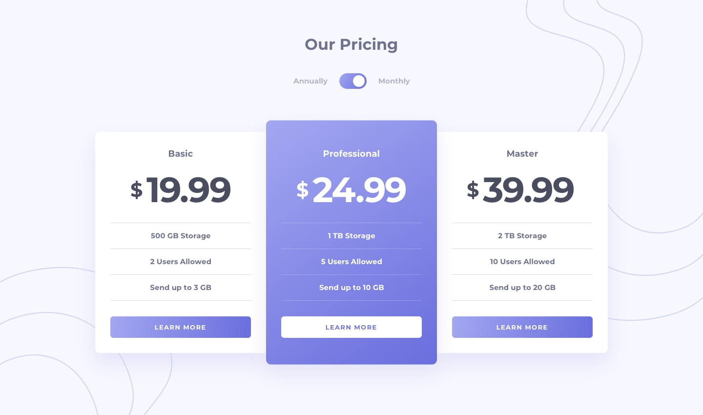

# Frontend Mentor - Pricing Component with Toggle

I built this project as part of a Frontend Mentor challenge to create a clean, responsive pricing comparison component with a monthly/annual toggle.

## Overview

The goal was to build a responsive UI with three pricing cards and a toggle that switches prices between monthly and annual billing.

## The Challenge

One of the main challenges was implementing the price switch using **CSS only** (without JavaScript).

- Requirement: Toggle between monthly and annual values.
- Constraint: Solve it with CSS, not JavaScript.
- Approach: Keep both price states in the markup and use CSS selectors/state-based styles to reveal the correct values.

## Problems I Encountered

One issue I ran into was the background image behavior:

- `bg-bottom.svg` was visible on mobile by default.
- I needed to hide it on mobile and reveal it again at the desktop breakpoint.

This was a useful responsive CSS lesson. I solved it by updating the breakpoint rules so the background stays hidden on smaller screens and appears only on desktop.

## Screenshot / Design References

### Design Targets
Monthly payment

Annual payment

Monthly payment - Mobile

Annual payment - Mobile

## Links

- GitHub Repository: https://github.com/your-username/pricing-component-with-toggle
- Live Demo: https://your-username.github.io/pricing-component-with-toggle/

## Built With

- Semantic HTML5
- CSS custom properties
- Flexbox
- Mobile-first responsive workflow
- CSS-only state toggling (no JavaScript)
